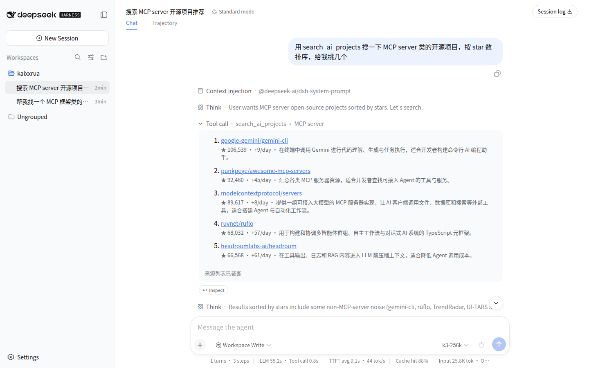

# dsh-aigc-radar

[AIGC Radar](https://aigcnews.cn) project search for [DeepSeek Harness](https://github.com/deepseek-ai/deepseek-harness) (`dsh`).

Find AI/Agent/MCP/RAG/LLM open-source projects without leaving your agent session. Results render as **native search cards** in the dsh Web UI — not raw markdown — and survive session replay.



## What you get

| Tool | What it does |
|---|---|
| `search_ai_projects` | Searches the curated AIGC Radar library: GitHub projects above a 500-star floor, enriched with categories, bilingual (zh/en) tags and descriptions, and daily star-growth metrics |
| `get_project_categories` | Lists the category taxonomy (categories + subcategory counts) for filter discovery |

Plus a system-prompt section that teaches the model when to route discovery questions here, so you don't have to say "use the tool" — ask "找个能做 deep research 的开源框架" and the agent comes back with starred, categorized results.

### Why a native plugin instead of the MCP server?

AIGC Radar also ships as an MCP server. Mounting it in dsh works, but the native plugin goes further:

- **Native `web` search cards** — structured sources render as cards in the Web UI and are rebuilt faithfully on session replay (`presentationMeta`), which the MCP transport cannot express
- **Typed canonical output** — the result is one validated JSON value, so Code Mode can compose it programmatically (`await tools.search_ai_projects({ q: 'mcp' })`) with full type inference
- **First-party prompt routing** — the discovery-routing guidance lives in system-prompt assembly, not in MCP instructions that clients may truncate

## Install

Requires `dsh` (`npx @deepseek-ai/dsh web`).

```sh
dsh plugin --profile web add github:Kaixxrua/dsh-aigc-radar
```

Git installs run the package's `prepare` build, which pnpm ≥10 refuses until you allow it: copy the package key pnpm prints into the profile's `pnpm-workspace.yaml`:

```yaml
allowBuilds:
  dsh-aigc-radar: true
```

then re-run the `add`. Pin a commit (`github:Kaixxrua/dsh-aigc-radar#<sha>`) if you want install-time immutability.

Verify without booting:

```sh
dsh --profile web --dump-config   # shows a "# == dsh-aigc-radar" layer
```

## Configure

Defaults point at the public deployment. Override the row from your profile's `cordis.patch.yml` (a patch replaces the row's whole config):

```yaml
- replace:
    - id: aigc-radar
      name: dsh-aigc-radar
      config:
        apiBase: 'https://aigcnews.cn'   # or your self-hosted AIGC_NEWS origin
        timeoutMs: 20000
        maxPageSize: 10
```

## Develop

```sh
pnpm install
pnpm build        # tsdown → dist/
pnpm typecheck    # tsc --noEmit
pnpm smoke        # hits the live API through the built client
```

Load from a dsh source checkout without installing:

```sh
pnpm dsh --profile web --patch /path/to/dsh-aigc-radar/cordis.dev.yml
```

where `cordis.dev.yml` inserts the row by absolute path:

```yaml
- insert:
    - id: aigc-radar
      name: /absolute/path/to/dsh-aigc-radar/dist/index.mjs
```

## Data and attribution

Data provided by [AIGC Radar](https://aigcnews.cn) — the public API your dsh instance calls is the same one behind the AIGCNEWS site and the AIGC Radar MCP server. The curated library only covers GitHub projects with 500+ stars; general non-AI GitHub search with direct-GitHub fallback remains an MCP-server capability by design.

## License

[MIT](LICENSE)
